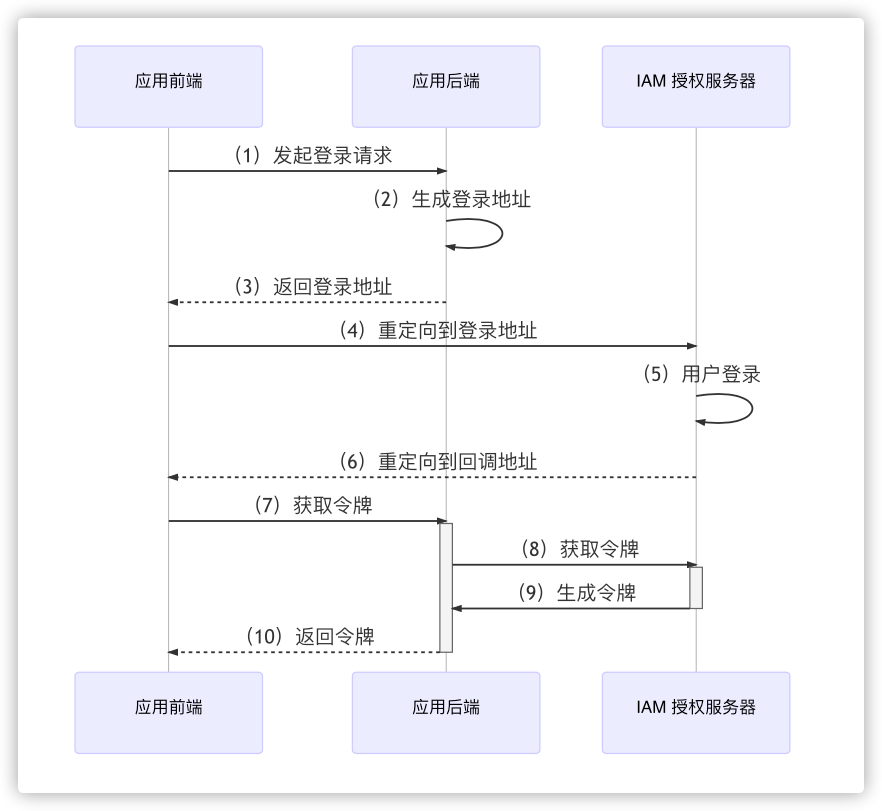
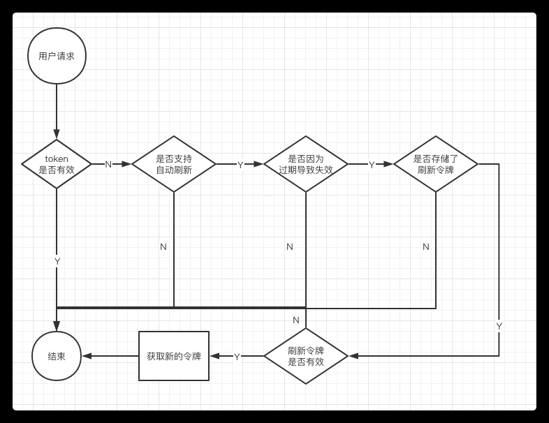

= IAM-Golang
李中月 <lizhongyue248@163.com>
v0.0.1, 2020-12-15
:toc:
:source-highlighter: coderay

image::https://img.shields.io/badge/commitizen-friendly-brightgreen.svg[Commitizen friendly]

本仓库是基于 KeyCloak 搭建的 IAM 的 Golang 版本支持。目前主要包含如下功能

- 用户登录
- 用户退出
- 用户授权
- 令牌解析
- 令牌静默刷新

WARNING: 注意：此项目只适用于前后端分离项目。

== 安装

本项目目前有两个模块：

- `iam` 核心模块，封装了核心的业务逻辑。
- `iam-gin` 对 gin 框架的适配示例，包括 `handler` 与 `middleware`。

.核心模块
----
go get -u github.com/baishan-development-guizhou/iam-golang/iam
----

== 使用

=== iam 模块

初始化客户端信息并调用初始化方法

[source,go, indent]
----
client := iam.Client{
    AuthorizationServer: "授权服务器地址",
    ClientId:            "客户端地址",
    ClientSecret:        "客户端密钥",
    RedirectUrl:         "http://127.0.0.1:8081/login",
    RedirectLogoutUrl:   "http://127.0.0.1:8081/logout",
    Scopes: []string{
        "openid",
        "email",
        "phone",
        "profile",
    },
    State:       "iam-test",
    AutoRefresh: true,
    Dev:         true,
}
client.Init()
----

主要拥有如下方法

.iam
|===
|方法名称 | 备注

|Init
|初始化所有配置信息

|ProviderClaim
|获取令牌提供者的信息

|AuthorizationServerUrl
|授权服务器地址，即登录地址

|LogoutUrl
|退出登录地址

|Authorization
|进行授权，即登录

|UserInfo
|获取用户信息

|checkExpiryAndRefresh
|检查是否过期以及刷新

|RefreshToken
|刷新令牌
|===

登录的核心业务流程如下图

- 在 `iam` 模块中，主要对第(2)、(8)步进行了封装。
- 在 `iam-gin` 模块中，则是除了前端之外都进行了封装。

刷新令牌的核心业务流程如下图

刷新令牌的前提条件是需要有一个地方进行存储 `RefreshToken`，可以通过 `AutoRefresh` 开启，默认情况下，会创建一个内存级别的 map 进行存储，实现 `TokenStore` 接口。核心代码如下：

[source,go, indent]
----
include::iam/store.go[lines=1..28]
----

如果需要存储到其他地方（如 redis），实现 `TokenStore` 接口后，将其传递给 `Client` 的 `TokenStore` 参数即可。

=== iam-gin 模块

使用示例，建议参照进行自定义。

[source,go, indent=0]
----
include::iam-gin/example/router.go[lines=15..29]
----

主要包含如下端点

.IamHandler
|===
|端点 | 内容

|AuthorizationServerRedirect
|重定向到授权服务器(302, Location)

|AuthorizationServer
|获取授权服务器地址(200, { url: "" })

|LogoutRedirect
|退出登录后重定向到应用地址(302, Location)

|Logout
|获取退出登录地址(200, { url: "" })

|Authorization
|授权地址，即获取令牌地址

|CheckToken
|获取用户信息
|===

全局中间件 `Authentication` 需要三个参数

. 客户端信息
. 是否 302 响应
. 如果 token 过期，存放刷新后的 token 的响应头 key
. 不进行验证的地址